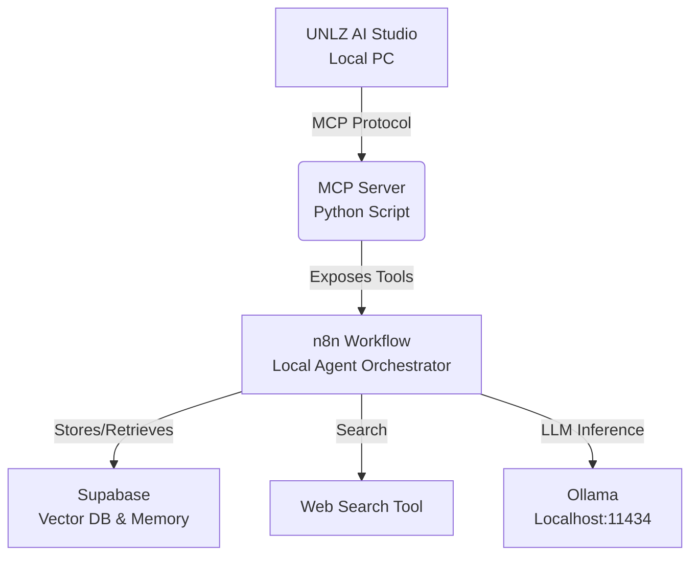

# Autonomous University Researcher Agent

[🇬🇧 English](README.md) | [🇪🇸 Español](README_ES.md)

## Overview

This project transforms the **UNLZ AI Studio** into an autonomous research agent. It uses the **Model Context Protocol (MCP)** to expose local university resources (files, hardware stats) to an agentic workflow orchestrated by **n8n** and powered by **Supabase** for memory and RAG.

## Architecture



## Setup

### 1. Prerequisites

- Python 3.10+
- n8n (Self-hosted)
- Ollama (installed locally)
- Supabase Account (Free Tier)

### 2. Installation

```bash
pip install -r requirements.txt
```

### 3. Running the MCP Server

```bash
python mcp_server.py
```
