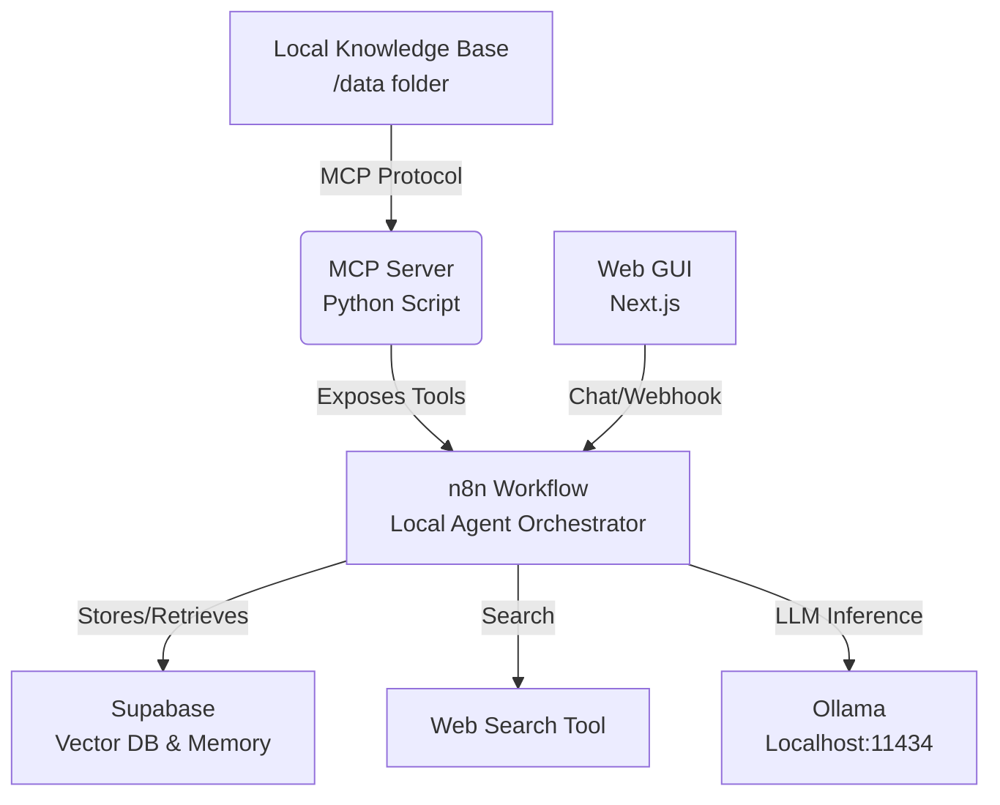

# UNLZ Agent: Autonomous Multi-Modal Assistant

[🇬🇧 English](README.md) | [🇪🇸 Español](README_ES.md)

This project is a **Multi-Modal Autonomous Agent** designed for flexible research and assistance. It orchestrates a local agentic workflow using **n8n**, integrating **Model Context Protocol (MCP)** for resource access and a flexible **RAG** pipeline for knowledge retrieval.

## Architecture



## System Capabilities

This application is engineered ensuring modularity, security, and scalability:

- **Hybrid RAG Architecture**: A flexible pipeline (`rag_pipeline/`) that supports both local persistence (ChromaDB) and cloud-based vector storage (Supabase), configurable via environment variables.
- **Security Guardrails**: Integrated input/output validation layer (`guardrails/`) to sanitise queries and prevent prompt injection attacks.
- **Extensible Tooling (MCP)**: Custom Model Context Protocol server exposing Python-based utilities to the agentic workflow.
- **Centralized Configuration**: Unified settings management (`config.py`) implementing the Factory pattern to switch between Local (Ollama) and Cloud (OpenAI) inference providers dynamically.
- **Modern Frontend**: A responsive Next.js web interface for agent interaction and system monitoring.

## Setup

### 1. Prerequisites

- Node.js 18+ (for Web GUI)
- Python 3.10+
- n8n (Self-hosted or Cloud)
- **LLM**: Ollama (Local) OR OpenAI (Cloud)
- **Vector DB**: ChromaDB (Local default) OR Supabase (Cloud)

### 2. Installation

```bash
pip install -r requirements.txt
```

### 3. Running the MCP Server

```bash
python mcp_server.py
```
