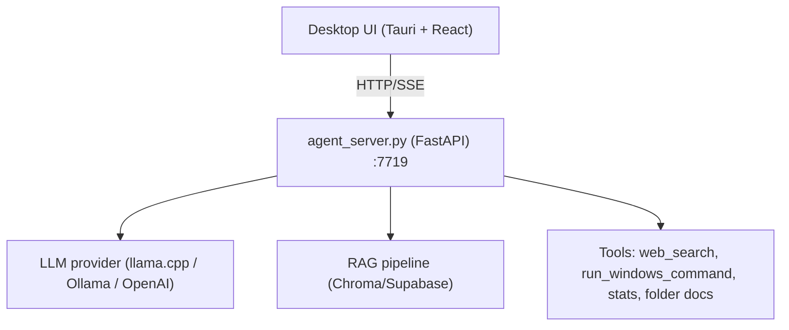

# Universidad Nacional de Lomas de Zamora - Facultad de Ingeniería
# UNLZ Agent

[🇬🇧 English](README_EN.md) | [🇪🇸 Español](README.md)

UNLZ Agent es un asistente local con interfaz desktop (Tauri + React) y backend FastAPI con herramientas, ejecución de acciones en Windows, carpetas de contexto y modos de planificación/iteración.

## Estado del Proyecto

- Modo recomendado actual: `desktop/` + `agent_server.py`
- Modo legado disponible: `frontend/` (Next.js) + `mcp_server.py` + n8n

## Arquitectura Actual (Desktop)



Documentación técnica:
- [Arquitectura](docs/ARCHITECTURE.md)
- [API](docs/API.md)

## Funcionalidades Principales

- Chat con streaming SSE (`step`, `chunk`, `error`, `done`)
- Chat con trazas de corrida (`run_id`) y score de confianza por respuesta
- Herramientas del agente:
  - `search_local_knowledge`
  - `search_folder_documents`
  - `web_search` (Google/DuckDuckGo/auto)
  - `get_current_time`
  - `get_system_stats`
  - `list_knowledge_base_files`
  - `run_windows_command`
- Modos de chat:
  - `normal`
  - `plan` (presenta alternativas y plan final)
  - `iterate` (planifica por etapas, ejecuta, valida y reintenta)
    - soporta dependencias entre etapas, etapas paralelizables y checkpoints
- Carpetas:
  - agrupan conversaciones
  - permiten comportamiento base + prompt personalizado por carpeta
  - soportan documentos exclusivos por carpeta
- Modo de ejecución de acciones:
  - `confirm` (pregunta antes de ejecutar)
  - `autonomous` (ejecución directa)
  - políticas por clase de operación (`AGENT_POLICY_*`: filesystem/network/process/system)
  - idempotencia y `dry-run` para acciones mutantes
- Barra de ventana configurable:
  - estilo `windows` o `mac`
  - lado `left/right`
  - orden de botones (`minimize/maximize/close`)
  - opción para minimizar a bandeja al cerrar (`MINIMIZE_TO_TRAY_ON_CLOSE`)
- Selector de modelos llama.cpp:
  - dropdown de `.gguf` detectados en carpeta de modelos y subdirectorios
  - botón de carpeta para elegir `LLAMACPP_MODELS_DIR` desde explorador
  - botón de archivo para elegir `llama-server.exe` desde explorador
  - botón `Instalar/Actualizar llama.cpp`:
    - instala llama.cpp automáticamente si no existe
    - actualiza cuando detecta nueva versión
    - autoconfigura `LLAMACPP_EXECUTABLE` y valores base
    - usa por defecto `<directorio de instalación>/llama.cpp` y modelos en `<directorio de instalación>/llama.cpp/models`
  - botón `↻` para reanalizar en caliente sin cerrar la app
- Vista Sistema:
  - CPU, RAM, VRAM
  - discos por unidad/letra (C:, D:, ...)
  - estado/control de Agent Server y llama.cpp
  - salud de conectores por API (`/connectors/health`)
- Chat:
  - edición de mensajes user/assistant
  - "Guardar y recalcular"
  - selector de comportamiento por cards en conversación vacía
  - cards de sugerencias que crean conversación y mantienen el texto prellenado en el input

## Requisitos

- Windows 10/11
- Python 3.10+
- Node.js 18+
- Rust toolchain (para Tauri)
- (Opcional) llama.cpp, Ollama, OpenAI API key

## Instalación Rápida

Desde la raíz del repo:

```powershell
.\setup-desktop.ps1
```

## Ejecución (Desktop)

```powershell
.\start-desktop.ps1
```

Esto levanta la app desktop y el backend local.

## Build .exe (Un Archivo)

Desde la raíz del repo:

```powershell
.\3_build_exe.bat
```

Genera un instalador único en:
- `dist-single-exe\UNLZ-Agent-Setup.exe`
- `UNLZ-Agent-Setup.exe` (copiado también en la raíz del proyecto)

Características del instalador:
- archivo único para distribuir
- instala app + backend sidecar automáticamente
- incluye instalación offline de WebView2 (no requiere descarga durante setup)
- selector de idioma en instalador (Español/English)
- ícono de instalador definido desde `desktop/src-tauri/icons/icon.ico`

## Configuración

La configuración vive en `.env` (editable desde UI o archivo):

- `LLM_PROVIDER=llamacpp|ollama|openai`
- `AGENT_LANGUAGE=es|en|zh`
- `AGENT_EXECUTION_MODE=confirm|autonomous`
- `WEB_SEARCH_ENGINE=google|duckduckgo|auto`
- `WEB_SEARCH_ENGINE=google|duckduckgo|serpapi|bing|fusion|auto`
- `AGENT_MAX_ITERATIONS`, `AGENT_MAX_TOOL_CALLS`, `AGENT_MAX_WALL_TIME_SEC`, `AGENT_TOOL_TIMEOUT_SEC`
- `AGENT_POLICY_FILESYSTEM|NETWORK|PROCESS|SYSTEM=allow|confirm|deny`
- `AGENT_TELEMETRY_OPT_IN=true|false`
- `MINIMIZE_TO_TRAY_ON_CLOSE=true|false`
- `WINDOW_CONTROLS_STYLE=windows|mac`
- `WINDOW_CONTROLS_SIDE=left|right`
- `WINDOW_CONTROLS_ORDER=minimize,maximize,close` (u otra permutación)
- `LLAMACPP_*`, `OLLAMA_*`, `OPENAI_*`, `SUPABASE_*`

Referencia inicial: `.env.example`.

## Modo Legado (Web)

El stack `frontend/` + `mcp_server.py` + n8n sigue en el repo para compatibilidad, pero no es el flujo principal recomendado.

## Troubleshooting Rápido

- `TypeError: network error` en UI:
  - revisar `agent_server.log`
  - reiniciar con `.\start-desktop.ps1`
- respuesta vacía en acciones:
  - verificar `AGENT_EXECUTION_MODE`
  - usar prompts de acción explícitos
- `llama.cpp unreachable`:
  - validar `LLAMACPP_EXECUTABLE`, `LLAMACPP_MODEL_PATH`, puerto `8080`
- `web_search` sin resultados:
  - cambiar `WEB_SEARCH_ENGINE` o reintentar
  - si falla, el agente devuelve error explícito de búsqueda web
