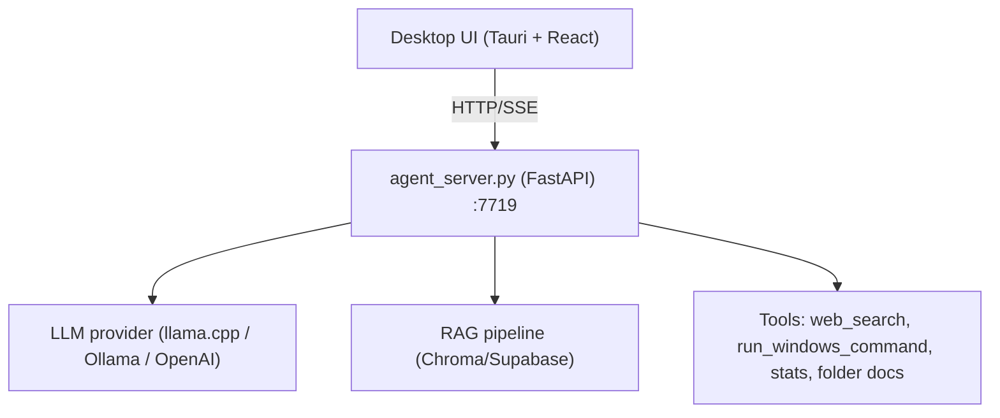

# Universidad Nacional de Lomas de Zamora - Facultad de Ingeniería
# UNLZ Agent

[🇬🇧 English](README_EN.md) | [🇪🇸 Español](README.md)

UNLZ Agent is a local desktop assistant (Tauri + React) with a FastAPI backend, tool execution on Windows, folder-scoped context, and planning/iteration modes.

## Project Status

- Current recommended mode: `desktop/` + `agent_server.py`
- Legacy mode still available: `frontend/` (Next.js) + `mcp_server.py` + n8n

## Current Architecture (Desktop)



Technical docs:
- [Architecture](docs/ARCHITECTURE.md)
- [API](docs/API.md)

## Main Features

- SSE chat streaming (`run`, `step`, `chunk`, `confidence`, `error`, `done`)
- per-run trace persistence with `run_id`
- Agent tools:
  - `search_local_knowledge`
  - `search_folder_documents`
  - `web_search` (Google/DuckDuckGo/auto)
  - `get_current_time`
  - `get_system_stats`
  - `list_knowledge_base_files`
  - `run_windows_command`
- Chat modes:
  - `normal`
  - `plan` (alternatives + final plan)
  - `iterate` (stage planning, execution, validation, retries)
    - supports stage dependencies, parallelizable stages, and checkpoints
- Folders:
  - group conversations
  - support base behavior + custom folder prompt
  - support folder-exclusive documents
- Action execution modes:
  - `confirm` (ask before running)
  - `autonomous` (run directly)
  - policy engine by operation class (`AGENT_POLICY_*`)
  - idempotency keys and `dry_run` for mutating actions
- Configurable window controls:
  - style `windows` or `mac`
  - side `left/right`
  - button order (`minimize/maximize/close`)
  - option to minimize to system tray on close (`MINIMIZE_TO_TRAY_ON_CLOSE`)
- llama.cpp model selector:
  - dropdown of `.gguf` models detected in model directories and subdirectories
  - folder button to pick `LLAMACPP_MODELS_DIR` from a native browser dialog
  - file button to pick `llama-server.exe` from a native browser dialog
  - `Install/Update llama.cpp` button:
    - installs llama.cpp automatically when missing
    - updates when a newer version is detected
    - auto-configures `LLAMACPP_EXECUTABLE` and baseline settings
    - defaults to `<install_dir>/llama.cpp` and models under `<install_dir>/llama.cpp/models`
  - `↻` button to rescan while the app is open
- Task router:
  - classifies incoming request by domain area (`ocr`, `rag`, `docgen_informe`, etc.)
  - selects winner model per area
  - applies automatic fallback model chain when primary fails
  - logs area/model quality metrics for recalibration
  - Settings UI:
    - area search/filter by name, model, profile, or keywords
    - add/remove areas directly from UI
    - global read-only metrics comparison table
    - clickable column sorting and pagination
    - local persistence of table preferences (`sort` and `pageSize`) when reopening Settings
- System view:
  - CPU, RAM, VRAM
  - disks per drive letter (C:, D:, ...)
  - Agent Server and llama.cpp status/control
- Chat UX:
  - edit user/assistant messages
  - "Save and recalculate"
  - behavior cards for empty conversations
  - suggestion cards now keep the prefilled draft in the input after creating a new conversation

## Requirements

- Windows 10/11
- Python 3.10+
- Node.js 18+
- Rust toolchain (for Tauri)
- (Optional) llama.cpp, Ollama, OpenAI API key

## Quick Setup

From repo root:

```powershell
.\setup-desktop.ps1
```

## Run (Desktop)

```powershell
.\start-desktop.ps1
```

This starts the desktop app and local backend.

## Single-File .exe Build

From repository root:

```powershell
.\3_build_exe.bat
```

This generates a single installer at:
- `dist-single-exe\UNLZ-Agent-Setup.exe`
- `UNLZ-Agent-Setup.exe` (also copied to project root)

Installer behavior:
- one file to distribute
- installs app + backend sidecar automatically
- uses offline WebView2 installation mode (no internet required during setup)
- installer language selector enabled (Spanish/English)
- installer icon explicitly set from `desktop/src-tauri/icons/icon.ico`

## Configuration

Config is stored in `.env` (editable from UI or file):

- `LLM_PROVIDER=llamacpp|ollama|openai`
- `AGENT_LANGUAGE=es|en|zh`
- `AGENT_EXECUTION_MODE=confirm|autonomous`
- `WEB_SEARCH_ENGINE=google|duckduckgo|serpapi|bing|fusion|auto`
- `AGENT_MAX_ITERATIONS`, `AGENT_MAX_TOOL_CALLS`, `AGENT_MAX_WALL_TIME_SEC`, `AGENT_TOOL_TIMEOUT_SEC`
- `AGENT_POLICY_FILESYSTEM|NETWORK|PROCESS|SYSTEM=allow|confirm|deny`
- `AGENT_TELEMETRY_OPT_IN=true|false`
- `TASK_ROUTER_AUTO_RECALIBRATE=true|false`
- `TASK_ROUTER_RECALIBRATE_INTERVAL=100`
- `TASK_ROUTER_MIN_SAMPLES=12`
- `MINIMIZE_TO_TRAY_ON_CLOSE=true|false`
- `WINDOW_CONTROLS_STYLE=windows|mac`
- `WINDOW_CONTROLS_SIDE=left|right`
- `WINDOW_CONTROLS_ORDER=minimize,maximize,close` (or other permutation)
- `LLAMACPP_*`, `OLLAMA_*`, `OPENAI_*`, `SUPABASE_*`

Use `.env.example` as baseline.

## Legacy Web Mode

The `frontend/` + `mcp_server.py` + n8n stack remains in the repo for compatibility, but it is not the primary recommended workflow.

## Quick Troubleshooting

- `TypeError: network error` in UI:
  - check `agent_server.log`
  - restart with `.\start-desktop.ps1`
- empty action output:
  - verify `AGENT_EXECUTION_MODE`
  - use explicit action prompts
- `llama.cpp unreachable`:
  - verify `LLAMACPP_EXECUTABLE`, `LLAMACPP_MODEL_PATH`, port `8080`
- `web_search` with no results:
  - switch `WEB_SEARCH_ENGINE` or retry
  - backend emits explicit web-search failure message when unavailable
