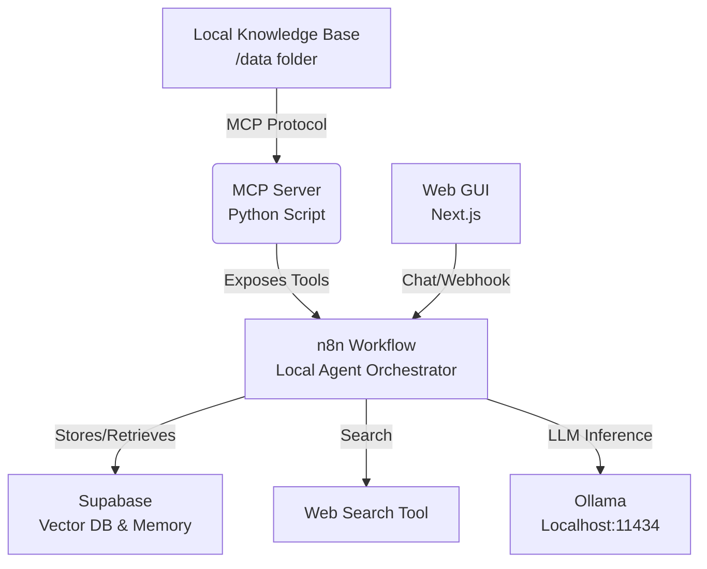

# Universidad Nacional de Lomas de Zamora - Facultad de Ingeniería
# UNLZ Agent: Autonomous Multi-Modal Assistant

[🇬🇧 English](README_EN.md) | [🇪🇸 Español](README.md)

This project is a **Multi-Modal Autonomous Agent** designed for flexible research and assistance. It orchestrates a local agentic workflow using **n8n**, integrating **Model Context Protocol (MCP)** for resource access and a flexible **RAG** pipeline for knowledge retrieval.

## Architecture



## System Capabilities

This application is engineered ensuring modularity, security, and scalability:

- **Hybrid RAG Architecture**: A flexible pipeline (`rag_pipeline/`) that supports both local persistence (ChromaDB) and cloud-based vector storage (Supabase), configurable via environment variables.
- **Security Guardrails**: Integrated input/output validation layer (`guardrails/`) to sanitise queries and prevent prompt injection attacks.
- **Extensible Tooling (MCP)**: Custom Model Context Protocol server exposing Python-based utilities to the agentic workflow.
- **Centralized Configuration**: Unified settings management (`config.py`) implementing the Factory pattern to switch between Local (Ollama) and Cloud (OpenAI) inference providers dynamically.
- **Modern Frontend**: A responsive Next.js web interface for agent interaction and system monitoring.

## Setup

### 1. Prerequisites

- Node.js 18+ (for Web GUI)
- Python 3.10+
- n8n (Self-hosted or Cloud)
- **LLM**: Ollama (Local) OR OpenAI (Cloud)
- **Vector DB**: ChromaDB (Local default) OR Supabase (Cloud)

### 2. Installation

1.  **Clone the repository**:

    ```bash
    git clone https://github.com/tu-usuario/UNLZ-Agent.git
    cd UNLZ-Agent
    ```

2.  **Backend Setup (Python)**:
    Required for the MCP Server and RAG pipeline.

    ```bash
    # Create virtual environment
    python -m venv venv

    # Activate virtual environment
    # Windows:
    .\venv\Scripts\activate
    # Mac/Linux:
    source venv/bin/activate

    # Install dependencies
    pip install -r requirements.txt
    ```

3.  **Frontend Setup (Node.js)**:
    Required for the Web Interface.

    ```bash
    cd frontend
    npm install
    # or
    yarn install
    ```

4.  **Configuration (Optional)**:
    You can configure the agent directly via the **Settings** page in the Web GUI.
    Alternatively, create a `.env` file in the root directory:

    ```env
    # Optional: Pre-configure settings
    VECTOR_DB_PROVIDER=chroma
    LLM_PROVIDER=ollama
    MCP_PORT=8000
    ```

### 3. Running the Application

This is a full-stack application. You only need to run the frontend, and it will automatically manage the backend (MCP Server) for you.

```bash
cd frontend
npm run dev
```

Open [http://localhost:3000](http://localhost:3000) in your browser. The "UNLZ Agent" backend will start automatically.
