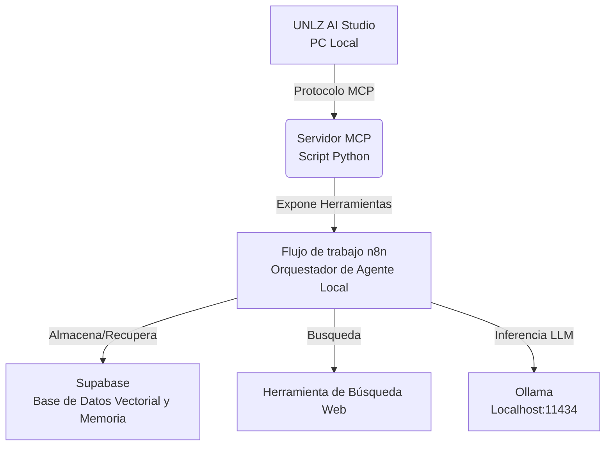

# Autonomous University Researcher Agent

[🇬🇧 English](README.md) | [🇪🇸 Español](README_ES.md)

## Descripción General

Este proyecto transforma el **UNLZ AI Studio** en un agente de investigación autónomo. Utiliza el **Protocolo de Contexto de Modelos (MCP)** para exponer recursos universitarios locales (archivos, estadísticas de hardware) a un flujo de trabajo agéntico orquestado por **n8n** y potenciado por **Supabase** para memoria y RAG (Generación Aumentada por Recuperación).

## Arquitectura



## Capacidades del Sistema

Esta aplicación está diseñada priorizando la modularidad, la seguridad y la escalabilidad:

- **Arquitectura RAG Híbrida**: Pipeline flexible (`rag_pipeline/`) que soporta tanto persistencia local (ChromaDB) como almacenamiento vectorial en la nube (Supabase), configurable dinámicamente.
- **Guardrails de Seguridad**: Capa de validación integrada (`guardrails/`) para sanitizar consultas y prevenir ataques de inyección de prompt.
- **Herramientas MCP Extensibles**: Servidor de Protocolo de Contexto de Modelos personalizado que expone utilidades Python al flujo de trabajo del agente.
- **Configuración Centralizada**: Gestión unificada de configuraciones (`config.py`) implementando patrones de diseño para alternar entre proveedores de inferencia Local (Ollama) y Cloud (OpenAI).
- **Frontend Moderno**: Interfaz web Next.js reactiva para la interacción con el agente y el monitoreo del sistema.

## Configuración

### 1. Requisitos Previos

- Python 3.10+
- n8n (Auto-hospedado)
- Ollama (instalado localmente)
- Cuenta de Supabase (Plan Gratuito)

### 2. Instalación

```bash
pip install -r requirements.txt
```

### 3. Ejecutar el Servidor MCP

```bash
python mcp_server.py
```
