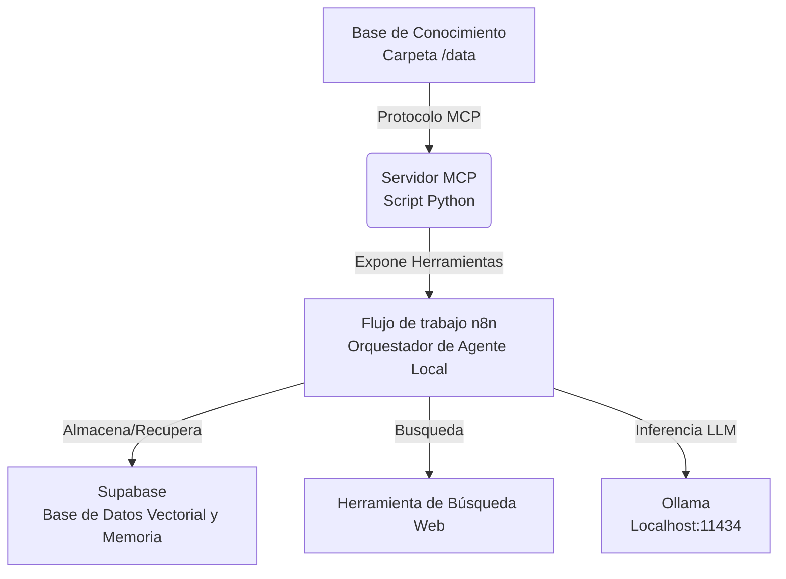

# UNLZ Agent: Asistente Autónomo Multi-Modal

[🇬🇧 English](README.md) | [🇪🇸 Español](README_ES.md)

## Descripción General

Este proyecto es un **Agente Autónomo Multi-Modal** diseñado para investigación y asistencia flexible. Utiliza el **Protocolo de Contexto de Modelos (MCP)** para exponer recursos locales (archivos, estadísticas) a un flujo de trabajo agéntico orquestado por **n8n** y potenciado por una arquitectura **RAG** flexible.

## Arquitectura



## Capacidades del Sistema

Esta aplicación está diseñada priorizando la modularidad, la seguridad y la escalabilidad:

- **Arquitectura RAG Híbrida**: Pipeline flexible (`rag_pipeline/`) que soporta tanto persistencia local (ChromaDB) como almacenamiento vectorial en la nube (Supabase), configurable dinámicamente.
- **Guardrails de Seguridad**: Capa de validación integrada (`guardrails/`) para sanitizar consultas y prevenir ataques de inyección de prompt.
- **Herramientas MCP Extensibles**: Servidor de Protocolo de Contexto de Modelos personalizado que expone utilidades Python al flujo de trabajo del agente.
- **Configuración Centralizada**: Gestión unificada de configuraciones (`config.py`) implementando patrones de diseño para alternar entre proveedores de inferencia Local (Ollama) y Cloud (OpenAI).
- **Frontend Moderno**: Interfaz web Next.js reactiva para la interacción con el agente y el monitoreo del sistema.

## Configuración

### 1. Requisitos Previos

- Python 3.10+
- n8n (Auto-hospedado o Cloud)
- **LLM**: Ollama (Local) O OpenAI (Cloud)
- **Base de Datos Vectorial**: ChromaDB (Local por defecto) O Supabase (Cloud)

### 2. Instalación

1.  **Clonar el repositorio**:

    ```bash
    git clone https://github.com/tu-usuario/UNLZ-Agent.git
    cd UNLZ-Agent
    ```

2.  **Configuración del Backend (Python)**:
    Necesario para el servidor MCP y el pipeline RAG.

    ```bash
    # Crear entorno virtual
    python -m venv venv

    # Activar entorno virtual
    # Windows:
    .\venv\Scripts\activate
    # Mac/Linux:
    source venv/bin/activate

    # Instalar dependencias
    pip install -r requirements.txt
    ```

3.  **Configuración del Frontend (Node.js)**:
    Necesario para la interfaz web.

    ```bash
    cd frontend
    npm install
    # o
    yarn install
    ```

4.  **Configuración (Opcional)**:
    Puedes configurar el agente directamente desde la página de **Configuración** en la interfaz web.
    Alternativamente, crea un archivo `.env` en el directorio raíz:

    ```env
    # Opcional: Pre-configurar ajustes
    VECTOR_DB_PROVIDER=chroma
    LLM_PROVIDER=ollama
    MCP_PORT=8000
    ```

### 3. Ejecutar la Aplicación

Esta es una aplicación "Full Stack". Solo necesitas iniciar el frontend, y este gestionará automáticamente el backend (Servidor MCP).

```bash
cd frontend
npm run dev
```

Abre [http://localhost:3000](http://localhost:3000) en tu navegador. El backend "UNLZ Agent" iniciará automáticamente.
