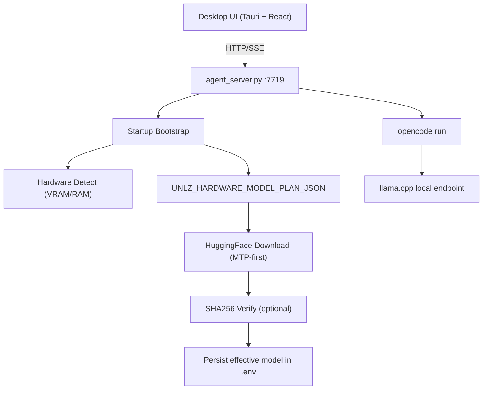

# Architecture - UNLZ Agent

## Resumen

Arquitectura simplificada y cerrada:

- Desktop UI: Tauri + React
- Backend: FastAPI (`agent_server.py`)
- Harness: opencode CLI
- Runtime LLM: llama.cpp bundleado
- Model policy: autoselección por hardware + autodescarga

## Diagrama

## Flujo de Arranque

1. Backend inicia y ejecuta bootstrap.
2. Fuerza runtime bloqueado:
   - `AGENT_HARNESS=opencode`
   - `LLM_PROVIDER=llamacpp`
   - `AGENT_EXECUTION_MODE=autonomous`
3. Detecta hardware y bucket (`cpu`, `gpu_4`, `gpu_8`, `gpu_12`, `gpu_16`, `gpu_24`, `gpu_32`).
4. Lee plan JSON y selecciona candidato principal.
5. Descarga modelo si falta.
6. Si falla candidato principal, prueba `fallback_candidates` en orden.
7. Si hay `sha256`, valida integridad.
8. Persiste selección efectiva en `.env`.

## Policy MTP-first

- `gpu_12+` prioriza variantes MTP.
- Fallback no-MTP habilitado para robustez.
- `gpu_24` exige perfil `1_*` desde OpenCode (`require_1_profile=true`).

## Bundle llama.cpp

Build de instalador incluye runtime en:

- `desktop/src-tauri/binaries/llama.cpp/**`

Luego se empaqueta como recurso Tauri/NSIS.

## Observabilidad

Endpoint:

- `GET /bootstrap/status`

Devuelve estado de bootstrap (`idle|running|downloading|ready|warning|error`), bucket, tier, modelo efectivo y detalle.
